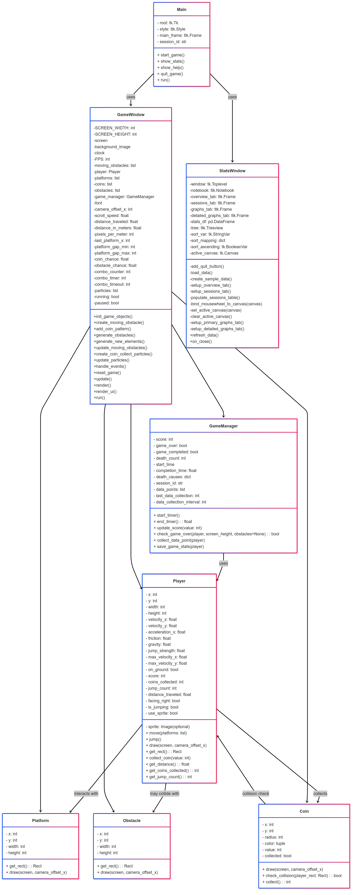

# CoinDash
## Project Overview
This project aims to develop a basic 2D platformer game using Python and Pygame. The game will involve a player-controlled character navigating through a single-level environment, avoiding obstacles, and reaching a goal. The mechanics will include jumping, running, and collecting simple items.

## Project Review
An example of a 2D platformer is Super Mario Bros., where the player jumps over obstacles and reaches a goal. However, this project will focus on a minimalistic design with easy-to-implement mechanics such as basic movement, collision detection, and score tracking. The game will exclude advanced AI and complex level structures to ensure a straightforward development process.

## Programming Development
**Game Concept**

The game will be a side-scrolling platformer where the player navigates through a single-level environment, avoiding obstacles and collecting coins to achieve the highest possible score. The player must jump over gaps, evade spikes, and avoid enemy objects while progressing. If they collide with an obstacle, fall into a gap, or are hit by an enemy, the game will be over. The game will track deaths based on their cause, such as falling or hitting an obstacle, to analyze difficulty. Since there is only one level, players must carefully time their movements and master the mechanics to successfully reach the goal.

**Key Features:**
1. character movement (jumping, running)
2. Collision detection
3. Collectibles (coins)
4. A single-level environment
5. Score tracking

**Object-Oriented Programming Implementation**

The game will implement the following five key classes:

1. Player - Handles movement and interactions. 
 - Attributes: position, velocity, score, jump_count, coins_collected, distance_traveled 
 - Methods: move(), jump(), collect_coin(),get_distance(), get_jump_count(), get_coins_collected
2. Platform – Represents solid surfaces the player can stand on. 
 - Attributes: position, width, height
 - Methods: check_collision()
3. Coin – Represents collectible items.
   - Attributes: position, value
   - Methods: collect()
4. GameManager – Controls the game flow and score tracking.
   - Attributes: score, game_over, death_count, completion_time
   - Methods: update_score(), check_game_over(), start_timer(), end_timer()
5. GameWindow – Manages rendering and game loop.
   - Attributes: screen, clock
   - Methods: render(), update()

**Algorithms Involved**

1. Basic Physics: Implementing gravity for smooth jumping.
2. Score Calculation: Keeping track of collected coins.
3. Event Handling: Responding to player input (jumping, movement).
4. Collision Detection: Checking if the player lands on a platform or collects a coin.

## Statistical Data (Prop Stats)

**Data Features**

|**Feature Name**  | **Why it is Good to Have** |**How to Obtain 50 Values** | **Variable & Class** | **Display Method** |
|-------------------|--------------------------------------------------|--------------------------------|----------------------------|-
|Distance Traveled | Measures how much the player moves, indicating engagement | Collect data every 10 seconds during gameplay | distance_traveled in Player class | Line graph showing how movement changes over time
|Coins Collected | Determines effectiveness of level design | Count each time a player collects a coin | coins_collected in Player class | Bar chart comparing number of coins collected per session
|Completion Time | Helps analyze difficulty level | Track time from level start to finish | completion_time in GameManager class | Histogram displaying completion time distribution
|Deaths | Identifies difficult areas | Count deaths per session and record cause | death_count in GameManager class | Pie chart showing death cause proportions
|**Jump Frequency** | Measures how often a player jumps | Count jump occurrences per session | jump_count in Player class | Scatter plot showing number of jumps per session

**Statistical value**

|**Feature Name** | **Statistical Values**|
|-----------------|--------------------------
|Completion Time | Average, Min, Max, Standard Deviation
|Deaths | Frequency of each cause (falling, hitting obstacle)

**Graph**

|**Graph** | **Feature Name** | **Graph Objective** | **Graph Type** | **X-axis** | **Y-axis**|
|----------|------------------|--------------------|-----------------|-------------|-
|Graph 1 | Distance Traveled | Track player engagement | Line Graph | Time | Distance Traveled
|Graph 2 | Jump Frequency | Analyze difficulty and skill level | Scatter Plot | Session Number | Number of Jumps
|Graph 3 | Coins Collected | Assess level design effectiveness | Bar Chart | Session Number | Coins Collected per Session
|Graph 4 | Deaths | Identify difficult areas | Pie Chart | Cause of Death | Frequency of Death
|Graph 5 | Completion Time | Analyze difficulty level | Histogram | Session Number | Completion Time

**Data Recording Method**

The statistical data will be stored in a CSV file for easy analysis. Data will be collected at fixed intervals 
(every 10 seconds) and upon key events (e.g., collecting a coin, jumping, dying).

**Data Analysis Report**

The recorded data will be analyzed using statistics such as total counts and averages. The analysis will be presented through:
Graphs showing player performance.
1. Line Graph: tracking player movement and jump frequency.
2. Bar chart: displaying coins collected per session for level design analysis.
3. Scatter Plot: Comparing jump frequency across multiple sessions to analyze difficulty.
4. Histogram: analyzing frequency distributions, such as time taken per session.
5. Tables: displaying collected data, including death causes and completion time statistics.

[Presentation](https://youtu.be/feAJWRtttz8?si=7hixMbUC3HD2o4Ba)
